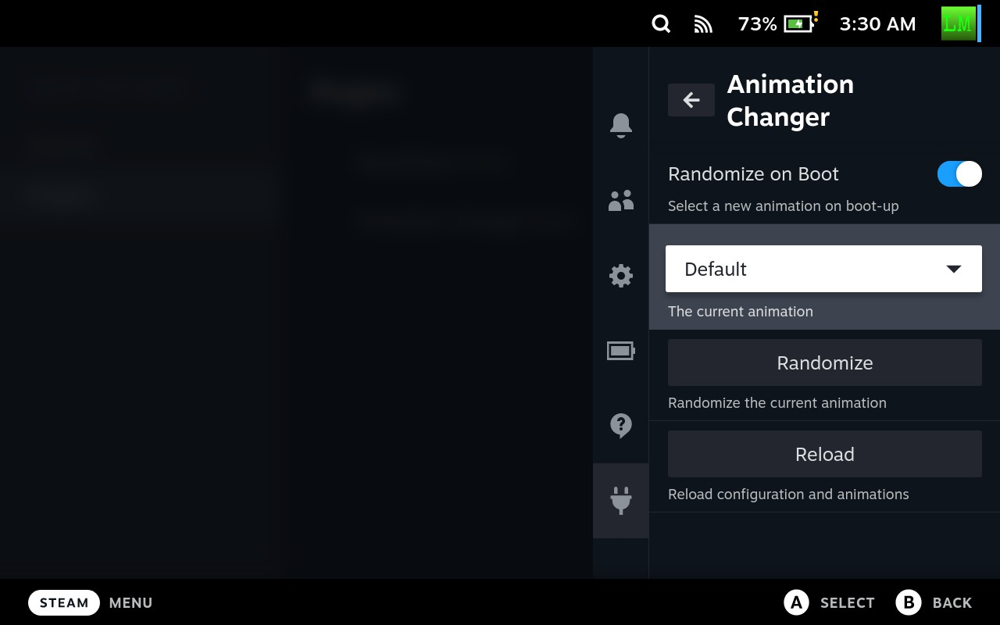

# Animation Changer
This is a Steam Deck Homebrew plugin for easily changing boot/suspend animations and randomizing
on boot.



## Plugin Usage
Use the plugin's animations browser to automatically browser and install animations from
[SteamDeckRepo](https://steamdeckrepo.com/). For now, only boot animations are available automatically. 
From the quick access menu, you can switch between animations or enable randomization on boot.

## Manual Usage
This plugin looks in `~/homebrew/animations` for directories containing sets of webm animation videos.
For example, directory `~/homebrew/animations/Test`, which could contain any or all of the three 
animation types.
The name of the directory is used as the animation label and each directory takes an optional
`config.json`. This allows specifying a relative path to each animation if different
from the default names. An empty string `""` or a missing file means to revert to the stock
animation when changing sets (Animation sets not implemented yet). `null` can be used to leave
the existing animation.
Press the reload button in the plugin's quick access menu page for manually added animations
to be detected. 

Example `config.json` configuration (Using default file names):
```json
{
   "boot": "deck_startup.webm",
   "suspend": "deck-suspend-animation.webm",
   "throbber": "deck-suspend-animation-from-throbber.webm"
}
```
`"boot"` refers to the main boot animation, `"suspend"` refers to the suspend animation played when
not in a game, and `"throbber"` refers to the animation played when suspending from in-game.

## Internals
- The main config file and downloaded animations are stored in `~/.config/AnimationChanger/`
- View the current log file at `/tmp/animation_changer.log`
- Animations get enabled by creating symlinks in the override directory, `~/.steam/root/config/uioverrides/movies`

## Building
Install pnpm and run `pnpm i` in the repo directory. Build with: `pnpm run build`. Copying the
project to the SDH plugins directory ~/homebrew/plugins at this point will install it. The VSCode
task does this cleanly without any unnecessary files and handles file permissions. 
